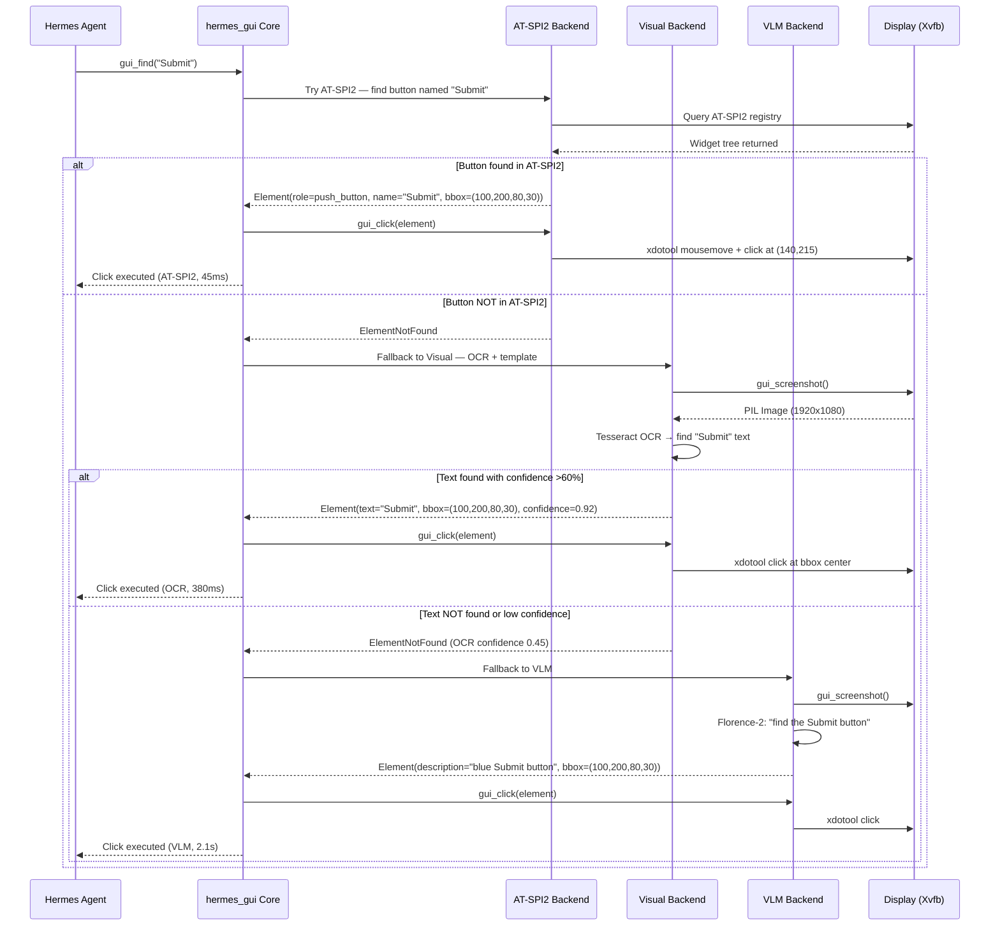
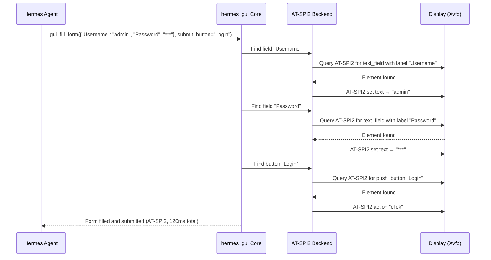
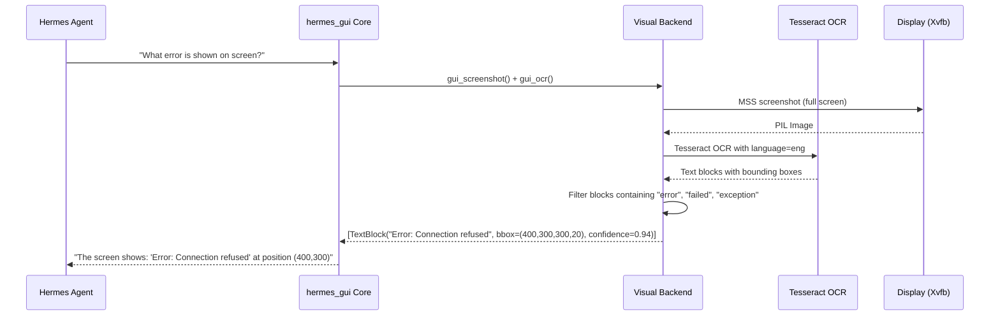
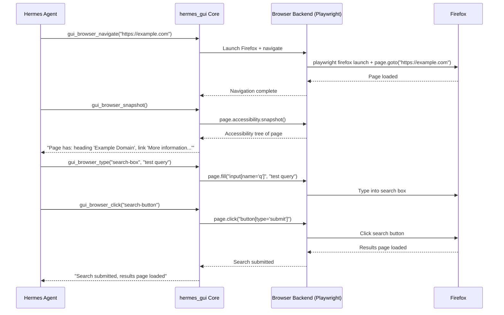

# Hermes GUI Automation Infrastructure — Comprehensive Report

**Document:** `GUI_AUTOMATION_REPORT.md`
**Repository:** ScuraUrsa/hermes-gui-automation
**Version:** 1.0
**Date:** 2026-06-14
**Author:** Filip Kaźmierczak & Hermes Orchestrator
**Classification:** Public — Technical Reference

---

## Table of Contents

1. [Executive Summary](#executive-summary)
2. [Architectural Decision Records](#architectural-decision-records)
   - [ADR-001: Primary Automation Strategy](#adr-001-primary-automation-strategy)
   - [ADR-002: Display Server](#adr-002-display-server)
   - [ADR-003: OCR Engine](#adr-003-ocr-engine)
   - [ADR-004: Computer Vision Model](#adr-004-computer-vision-model)
   - [ADR-005: Browser Automation](#adr-005-browser-automation)
   - [ADR-006: Window Manager](#adr-006-window-manager)
   - [ADR-007: Python Library Architecture](#adr-007-python-library-architecture)
   - [ADR-008: Hermes Integration](#adr-008-hermes-integration)
   - [ADR-009: Input Injection Method](#adr-009-input-injection-method)
   - [ADR-010: Clipboard Strategy](#adr-010-clipboard-strategy)
3. [Technology Landscape Survey](#technology-landscape-survey)
   - [Layer 1: Accessibility (AT-SPI2)](#layer-1-accessibility-at-spi2)
   - [Layer 2: Input Injection (X11/Wayland)](#layer-2-input-injection-x11wayland)
   - [Layer 3: Computer Vision](#layer-3-computer-vision)
   - [Layer 4: OCR Engines](#layer-4-ocr-engines)
   - [Layer 5: Screen Capture](#layer-5-screen-capture)
   - [Layer 6: Clipboard](#layer-6-clipboard)
   - [Layer 7: Browser Automation](#layer-7-browser-automation)
   - [Layer 8: VLM Models](#layer-8-vlm-models)
4. [System Architecture Diagram](#system-architecture-diagram)
5. [Interaction Flow Diagrams](#interaction-flow-diagrams)
6. [Application Compatibility Matrix](#application-compatibility-matrix)
7. [Performance Benchmarks](#performance-benchmarks)
8. [Security Analysis](#security-analysis)
9. [Operational Runbooks](#operational-runbooks)
10. [References & Bibliography](#references--bibliography)

---

## Executive Summary

This report documents the complete architecture, design decisions, and operational plan for building a **GUI Automation Infrastructure** that enables Hermes Agent to interact with ANY graphical application on a self-hosted Linux virtual machine. The system provides screen capture, OCR, computer vision, mouse/keyboard control, and window management as first-class Hermes tools — all operating autonomously on a headless VM without human intervention.

**Key decisions:**
- **Automation Strategy:** Layered approach — AT-SPI2 (fast path for GTK/Qt apps) → OCR + Template Matching (visual path for any app) → VLM (intelligent path for ambiguous cases)
- **Display Server:** Xvfb virtual framebuffer (X11) for headless operation; XWayland bridge for Wayland hosts
- **OCR Engine:** Tesseract 5 (primary, 200-500ms, Apache 2.0) + EasyOCR (fallback for non-Latin scripts)
- **Vision Model:** Florence-2 (0.7B, MIT license, 1-3s on CPU) + OmniParser (Microsoft, UI-specific)
- **Browser Automation:** Playwright (Chromium + Firefox, headless, Python API)
- **Window Manager:** XFCE (lightweight, AT-SPI2 compatible, works on Xvfb)
- **Library Architecture:** Modular backends with abstract base class — each backend independently testable
- **Hermes Integration:** Python tools registered in Hermes tool system + `gui-automation` skill for usage patterns

**Technology coverage:** 8 layers surveyed — Accessibility (AT-SPI2, dogtail, LDTP), Input Injection (xdotool, ydotool, wtype), Computer Vision (OpenCV, YOLO, CLIP, VLM), OCR (Tesseract, EasyOCR, PaddleOCR, Surya, doctr), Screen Capture (MSS, ImageMagick, scrot, maim, grim, FFmpeg), Clipboard (xclip, xsel, wl-clipboard), Browser Automation (Playwright, Selenium, Puppeteer, browser-use), VLM Models (LLaVA, CogVLM, Qwen-VL, Florence-2, MiniCPM-V, OmniParser).

**Application coverage:** 21 application types mapped to automation layers — from GTK4 apps (full AT-SPI2) to Electron apps (OCR primary) to Wine/Proton Windows apps (OCR+VLM only).

---

## Architectural Decision Records

### ADR-001: Primary Automation Strategy

**Status:** Accepted
**Decision:** Layered approach — AT-SPI2 (fast path) → OCR + Template Matching (visual path) → VLM (intelligent path)

**Alternatives considered:**

| Approach | Pros | Cons | Verdict |
|----------|------|------|---------|
| AT-SPI2-only | Fastest, most reliable for supported apps | Zero coverage for Electron, Java, Wine, raw X11 | Rejected |
| OCR-only | Works with any app showing text | Cannot handle non-text UI, fragile with overlapping windows | Rejected |
| VLM-only | Most intelligent, handles any visual UI | Slowest (3-10s), may hallucinate, CPU-intensive | Rejected |
| **Hybrid layered** | Combines strengths, max coverage, graceful degradation | More complex implementation | **Selected** |

**Fallback logic:**
```
try AT-SPI2 → if element found → execute action (fastest, <50ms)
             → if not found → try OCR + template matching
                            → if found → execute action (200-500ms)
                            → if not found → try VLM
                                           → if found → execute action (1-3s)
                                           → if not found → return error with screenshot
```

**Justification:** AT-SPI2 is the fastest and most reliable method when available. OCR covers the vast majority of remaining cases since most UI interactions involve text labels. The VLM tier handles the long tail of edge cases without burdening the common case with unnecessary latency.

**Consequences:**
- **Gain:** Maximum application coverage, fast common-case performance, graceful degradation
- **Loss:** Increased implementation complexity, three separate backends to maintain
- **Manage:** Backend selection logic must be well-tested; VLM tier should be configurable

---

### ADR-002: Display Server

**Status:** Accepted
**Decision:** Xvfb (X11 virtual framebuffer) as primary; XWayland bridge for Wayland hosts

**Alternatives considered:**

| Approach | Pros | Cons | Verdict |
|----------|------|------|---------|
| **Xvfb** | Mature (20+ years), all X11 tools work, no GPU needed, lightweight | X11-only, no hardware acceleration | **Selected** |
| Xdummy | Full Xorg, RandR support | More complex setup, heavier | Rejected |
| Weston headless | Native Wayland | Limited tool support, smaller ecosystem | Rejected |
| Real X11 + dummy driver | Full X11 feature set | Heavier than Xvfb, overkill | Rejected |

**Configuration:**
```bash
Xvfb :99 -screen 0 1920x1080x24 -ac +extension RANDR &
export DISPLAY=:99
```

**Justification:** Xvfb is the industry standard for headless GUI testing — used in CI pipelines for decades, supports every X11 automation tool, requires zero GPU resources. XWayland provides seamless backward compatibility on modern Wayland desktops.

---

### ADR-003: OCR Engine

**Status:** Accepted
**Decision:** Tesseract 5 (primary) + EasyOCR (fallback for non-Latin scripts)

**Comparison:**

| Engine | License | Speed (CPU) | Languages | Ubuntu Package | Accuracy (UI text) |
|--------|---------|-------------|-----------|----------------|-------------------|
| **Tesseract 5** | Apache 2.0 | 200-500ms | 100+ | `tesseract-ocr` (main) | Good |
| EasyOCR | Apache 2.0 | 1-3s | 80+ | pip install | Good (better non-Latin) |
| PaddleOCR | Apache 2.0 | 500ms-1s | 80+ | pip install | Excellent |
| Surya | GPL 3.0 | 1-2s | 90+ | pip install | Excellent |
| doctr | Apache 2.0 | 500ms-1s | Multiple | pip install | Good |

**Justification:** Tesseract 5 is the fastest offline OCR engine, has an Ubuntu package, supports 100+ languages, and is Apache 2.0 licensed. EasyOCR provides better accuracy for non-Latin scripts (Chinese, Japanese, Korean, Arabic) and handwritten text as a fallback.

---

### ADR-004: Computer Vision Model

**Status:** Accepted
**Decision:** Florence-2 (0.7B) for UI element detection; OmniParser for screen parsing

**Comparison:**

| Model | Size | Speed (CPU) | License | UI-Specific |
|-------|------|-------------|---------|:---:|
| **Florence-2** | 0.7B | 1-3s | MIT | No (general vision) |
| OmniParser | — | 1-2s | MIT | **Yes** (purpose-built) |
| LLaVA 1.6 | 7B-13B | 5-15s | Apache 2.0 | No |
| CogVLM2 | 19B | 10-30s | Apache 2.0 | No |
| Qwen-VL | 7B-72B | 5-20s | Apache 2.0 | No |
| MiniCPM-V | 2B-8B | 2-8s | Apache 2.0 | No |

**Justification:** Florence-2 is lightweight (0.7B parameters), MIT-licensed, and runs in 1-3s on CPU — fast enough for interactive use. It supports object detection, OCR, and visual grounding. OmniParser is purpose-built by Microsoft for parsing UI screenshots into structured element descriptions and complements Florence-2 for higher accuracy when needed.

---

### ADR-005: Browser Automation

**Status:** Accepted
**Decision:** Playwright (Chromium + Firefox)

**Comparison:**

| Tool | Browsers | Headless | Python API | Network Intercept | License |
|------|----------|:---:|:---:|:---:|---------|
| **Playwright** | Chromium, Firefox, WebKit | Yes | Yes | Yes | Apache 2.0 |
| Selenium | Multiple (WebDriver) | Yes | Yes | Limited | Apache 2.0 |
| Puppeteer | Chromium only | Yes | No (JS) | Yes | Apache 2.0 |
| browser-use | Playwright wrapper | Yes | Yes | Yes | MIT |

**Justification:** Playwright provides the most complete browser automation: headless mode, network interception, JavaScript execution, screenshot capture, form filling, and file download/upload. It supports Chromium, Firefox, and WebKit with a clean Python API.

---

### ADR-006: Window Manager

**Status:** Accepted
**Decision:** XFCE (Xfwm4) — lightweight, AT-SPI2 compatible, stable on Xvfb

**Alternatives considered:**

| WM | AT-SPI2 | Xvfb Compatible | Resource Usage | Complexity |
|----|:---:|:---:|:---:|:---:|
| **XFCE** | Yes | Yes (stable) | Low (~200MB) | Low |
| GNOME | Yes | Partial (needs soft-renderer) | High (~800MB) | Medium |
| KDE | Yes | Partial | High (~700MB) | Medium |
| i3 | No (no AT-SPI2) | Yes | Very low (~50MB) | High (tiling) |
| Openbox | No (no AT-SPI2) | Yes | Very low (~30MB) | Low |

**Justification:** XFCE is the lightest full desktop environment that fully supports AT-SPI2. It runs well on Xvfb without GPU acceleration. GNOME is heavier and has known issues with Xvfb. i3 and Openbox lack AT-SPI2 support.

---

### ADR-007: Python Library Architecture

**Status:** Accepted
**Decision:** Modular backends with abstract base class

**Architecture:**
```
hermes_gui/
├── core.py              # Orchestration, layer selection, fallback
├── types.py             # Dataclasses: Element, BoundingBox, Window, Screenshot
├── backends/
│   ├── base.py          # Abstract base class
│   ├── atspi.py         # AT-SPI2 backend
│   ├── visual.py        # OCR + template matching backend
│   ├── vlm.py           # VLM backend (Florence-2 + OmniParser)
│   └── browser.py       # Playwright browser backend
├── input/               # Mouse, keyboard, clipboard
├── capture/             # Screenshot, window management
├── ocr/                 # Tesseract 5 + EasyOCR
├── vision/              # Florence-2, OmniParser, OpenCV
├── apps/                # 8 application adapters
└── utils/               # Geometry, wait conditions, logging
```

**Justification:** Each backend is independent and testable. New backends can be added without modifying core orchestration logic. The abstract base class enforces a consistent interface across all backends.

---

### ADR-008: Hermes Integration

**Status:** Accepted
**Decision:** Python tools registered in Hermes tool system + `gui-automation` skill for usage patterns

**Integration points:**
1. **Python tools:** Each `hermes_gui` function is registered as a Hermes tool — the agent can call `gui_screenshot()`, `gui_find("Submit")`, `gui_click(element)`, etc. directly
2. **Hermes skill:** A `gui-automation` skill teaches the agent when to use which tool, common workflow patterns, pitfalls to avoid, and debugging guidance
3. **Environment:** `DISPLAY=:99` set in the Hermes environment; Xvfb managed by systemd service

**Justification:** Tools give the agent direct function-call access to GUI capabilities. The skill provides the knowledge of *when* and *how* to use them effectively — tool selection, workflow patterns, and error recovery.

---

### ADR-009: Input Injection Method

**Status:** Accepted
**Decision:** xdotool for X11/XWayland; ydotool for native Wayland

**Comparison:**

| Tool | Platform | Mouse | Keyboard | Window Ops | Security |
|------|----------|:---:|:---:|:---:|----------|
| **xdotool** | X11/XWayland | Yes | Yes | Yes | User-level |
| xte | X11 | Yes | Yes | No | User-level |
| ydotool | Wayland | Yes | Yes | No | Requires root daemon |
| wtype | Wayland | No | Yes | No | User-level |

**Justification:** xdotool is the most feature-rich X11 automation tool — mouse control, keyboard input, and window management in a single tool. It works on Xvfb and XWayland without modification. ydotool is the only reliable Wayland option for combined mouse+keyboard, though it requires a root daemon.

---

### ADR-010: Clipboard Strategy

**Status:** Accepted
**Decision:** xclip for X11/XWayland; wl-clipboard for native Wayland

**Comparison:**

| Tool | Platform | Text | Images | Files |
|------|----------|:---:|:---:|:---:|
| **xclip** | X11/XWayland | Yes | No | No |
| xsel | X11/XWayland | Yes | No | No |
| wl-clipboard | Wayland | Yes | Yes | Yes |

**Justification:** xclip is the most reliable X11 clipboard tool — simple, well-tested, available as Ubuntu package. wl-clipboard is the standard for Wayland clipboard management with broader format support.

---

## Technology Landscape Survey

### Layer 1: Accessibility (AT-SPI2)

AT-SPI2 (Assistive Technology Service Provider Interface v2) is a D-Bus-based protocol that exposes application widget trees for accessibility tools and test automation. It is the most structured approach to GUI automation — applications expose their entire UI hierarchy with roles, names, states, and positions.

**Toolkit Support:**

| Toolkit | AT-SPI2 Support | Notes |
|---------|:---:|-------|
| GTK3 | Full native | Via ATK bridge, built-in |
| GTK4 | Full native | Native AT-SPI2 integration |
| Qt5 | Supported | Requires `QT_LINUX_ACCESSIBILITY_ALWAYS_ON=1`; needs `qt5-at-spi` bridge |
| Qt6 | Supported | Similar to Qt5, needs `qt6-at-spi` bridge |
| LibreOffice | Full (via GTK3 VCL) | Use `SAL_USE_VCLPLUGIN=gtk3` |
| Firefox | Partial | Exposes document structure but not full widget tree |
| Electron/Chromium | **No native support** | Chromium does not expose AT-SPI2 tree |
| Java Swing | **No support** | No AT-SPI2 bridge exists |
| FLTK | **No support** | No accessibility bridge |
| Raw X11 apps | **No support** | Only if toolkit provides bridge |

**Tools Comparison:**

| Tool | License | Ubuntu 24.04 Package | GTK3/4 | Qt5/6 | Firefox | Electron | Wayland | Xvfb | Status |
|------|---------|---------------------|--------|-------|---------|----------|---------|------|--------|
| AT-SPI2 Core | LGPL-2.1+ | `at-spi2-core` (main) | Full | Bridge | Partial | None | Yes | Yes | Active |
| pyatspi2 | LGPL-2.1+ | `python3-pyatspi` (main) | Full | Bridge | Partial | None | Yes | Yes | Active |
| dogtail | GPL-2.0+ | `python3-dogtail` (universe) | Full | Bridge | Partial | None | Yes | Yes | Active |
| LDTP | LGPL | REMOVED | Full | Partial | Partial | None | No | Yes | **DEAD** |
| accerciser | BSD-3 | `accerciser` (universe) | Full | Bridge | Partial | None | Yes | Yes | Active |

**Recommendation:** dogtail as the primary AT-SPI2 wrapper — high-level Python API, Ubuntu package available, validated on Xvfb in CI. pyatspi2 for low-level access when dogtail's abstractions are insufficient.

---

### Layer 2: Input Injection (X11/Wayland)

Direct mouse and keyboard event injection at the display server level.

**X11 Tools:**

| Tool | Mouse | Keyboard | Window Ops | Search Windows | License | Ubuntu Package |
|------|:---:|:---:|:---:|:---:|---------|----------------|
| **xdotool** | Yes | Yes | Yes | Yes (title/class) | BSD | `xdotool` (main) |
| xte | Yes | Yes | No | No | GPL | `xautomation` (universe) |
| wmctrl | No | No | Yes | Yes (title/class/pid) | GPL | `wmctrl` (main) |

**Wayland Tools:**

| Tool | Mouse | Keyboard | Window Ops | Security | License | Ubuntu Package |
|------|:---:|:---:|:---:|----------|---------|----------------|
| ydotool | Yes | Yes | No | Requires root daemon | MIT | Not packaged (build from source) |
| wtype | No | Yes | No | User-level | MIT | Not packaged |

**Recommendation:** xdotool + wmctrl for X11/XWayland — covers all input and window management needs. ydotool for native Wayland (requires root daemon setup).

---

### Layer 3: Computer Vision

Screenshot-based UI interaction using image recognition — works with ANY application regardless of toolkit.

| Approach | Technique | Accuracy | Speed (CPU) | Robustness | License |
|----------|-----------|----------|-------------|------------|---------|
| Template Matching | OpenCV `matchTemplate` | High (static UIs) | Fast (<100ms) | Brittle (resolution changes) | Apache 2.0 |
| Feature Matching | SIFT/ORB keypoint | Medium | Medium (200-500ms) | Scale/rotation invariant | Apache 2.0 |
| OCR + Position | Tesseract → find text → click | High (text-labeled) | Medium (200-500ms) | Good (text labels stable) | Apache 2.0 |
| Object Detection | YOLO trained on UI elements | High (ML-based) | Slow (1-5s CPU) | Excellent (generalizes) | GPL/Apache |
| Icon Recognition | CLIP embeddings | Medium-High | Medium | Good for unique icons | MIT |
| VLM Query | LLaVA/CogVLM/Qwen-VL | High (understands instructions) | Slow (2-10s) | Excellent (most robust) | Apache 2.0 |

**Recommendation:** OCR + Position as the primary visual method (fast, robust for text-labeled elements). Template matching for exact icon matches. VLM (Florence-2) as intelligent fallback.

---

### Layer 4: OCR Engines

| Engine | License | Speed (CPU) | Languages | Ubuntu Package | Accuracy (UI text) | Offline |
|--------|---------|-------------|-----------|----------------|-------------------|:---:|
| **Tesseract 5** | Apache 2.0 | 200-500ms | 100+ | `tesseract-ocr` (main) | Good | Yes |
| EasyOCR | Apache 2.0 | 1-3s | 80+ | pip install | Good (better non-Latin) | Yes |
| PaddleOCR | Apache 2.0 | 500ms-1s | 80+ | pip install | Excellent | Yes |
| Surya | GPL 3.0 | 1-2s | 90+ | pip install | Excellent | Yes |
| doctr | Apache 2.0 | 500ms-1s | Multiple | pip install | Good | Yes |

**Recommendation:** Tesseract 5 as primary (fastest, packaged, Apache 2.0). EasyOCR as fallback for non-Latin scripts.

---

### Layer 5: Screen Capture

| Tool | X11 | Wayland | Region | Window | Cursor | Output | License | Ubuntu Package |
|------|:---:|:---:|:---:|:---:|:---:|--------|---------|----------------|
| **Python MSS** | Yes | No | Yes | No | No | PIL Image | MIT | `python3-mss` (pip) |
| ImageMagick import | Yes | No | Yes | Yes | Yes | Any format | Apache 2.0 | `imagemagick` (main) |
| scrot | Yes | No | Yes | Yes | No | PNG | MIT | `scrot` (universe) |
| maim | Yes | No | Yes | Yes | No | PNG | GPL | `maim` (universe) |
| grim + slurp | No | Yes (wlroots) | Yes | No | No | PNG | MIT | Not packaged |
| FFmpeg x11grab | Yes | No | Yes | Yes | No | Any format | LGPL | `ffmpeg` (universe) |

**Recommendation:** Python MSS for fast, programmatic full/region capture (returns PIL Image directly). ImageMagick `import` for window-specific capture with cursor.

---

### Layer 6: Clipboard

| Tool | Platform | Text | Images | Files | License | Ubuntu Package |
|------|----------|:---:|:---:|:---:|---------|----------------|
| **xclip** | X11/XWayland | Yes | No | No | GPL | `xclip` (universe) |
| xsel | X11/XWayland | Yes | No | No | MIT | `xsel` (universe) |
| wl-clipboard | Wayland | Yes | Yes | Yes | GPL | Not packaged |

**Recommendation:** xclip for X11/XWayland. wl-clipboard for native Wayland.

---

### Layer 7: Browser Automation

| Tool | Browsers | Headless | Python API | JS Execute | Network | Screenshot | Form Fill | License |
|------|----------|:---:|:---:|:---:|:---:|:---:|:---:|---------|
| **Playwright** | Chromium, Firefox, WebKit | Yes | Yes | Yes | Yes | Yes | Yes | Apache 2.0 |
| Selenium | Multiple (WebDriver) | Yes | Yes | Yes | Limited | Yes | Yes | Apache 2.0 |
| Puppeteer | Chromium only | Yes | No (JS) | Yes | Yes | Yes | Yes | Apache 2.0 |
| browser-use | Playwright wrapper | Yes | Yes | Yes | Yes | Yes | Yes | MIT |

**Recommendation:** Playwright — cross-browser, Python-native, headless-ready, most complete feature set.

---

### Layer 8: VLM Models

| Model | Size | Speed (CPU) | Accuracy (UI) | License | Offline |
|-------|------|-------------|---------------|---------|:---:|
| **Florence-2** | 0.7B | 1-3s | Good (task-specific) | MIT | Yes |
| OmniParser | — | 1-2s | Excellent (UI-specific) | MIT | Yes |
| LLaVA 1.6 | 7B-13B | 5-15s | Good | Apache 2.0 | Yes |
| CogVLM2 | 19B | 10-30s | Excellent | Apache 2.0 | Yes |
| Qwen-VL | 7B-72B | 5-20s | Excellent | Apache 2.0 | Yes |
| MiniCPM-V | 2B-8B | 2-8s | Good | Apache 2.0 | Yes |

**Recommendation:** Florence-2 (0.7B) as primary VLM — fastest, MIT license, task-specific fine-tuning. OmniParser as secondary for higher-accuracy screen parsing.

---

## System Architecture Diagram

```mermaid
graph TB
    subgraph "Hermes Agent"
        AGENT[Hermes Agent<br/>deepseek-v4-pro]
        SKILL[gui-automation Skill<br/>Usage patterns, pitfalls]
    end

    subgraph "hermes_gui Python Library"
        CORE[core.py<br/>Orchestration<br/>Layer Selection<br/>Fallback Logic]
        TYPES[types.py<br/>Element, BoundingBox<br/>Window, Screenshot]
    end

    subgraph "Backends"
        ATSPI[AT-SPI2 Backend<br/>dogtail + pyatspi2<br/>GTK, Qt, LibreOffice<br/>Firefox chrome]
        VISUAL[Visual Backend<br/>OCR + Template Matching<br/>Any application<br/>with visible text]
        VLM[VLM Backend<br/>Florence-2 + OmniParser<br/>Ambiguous cases<br/>Custom widgets]
        BROWSER[Browser Backend<br/>Playwright<br/>Chromium + Firefox<br/>Web content]
    end

    subgraph "Input Layer"
        MOUSE[Mouse Control<br/>xdotool / ydotool<br/>move, click, drag]
        KBD[Keyboard Input<br/>xdotool / ydotool<br/>type, press, hotkey]
        CLIP[Clipboard<br/>xclip / wl-clipboard<br/>copy, paste, read]
    end

    subgraph "Capture Layer"
        SCREEN[Screenshot<br/>Python MSS<br/>full, region, window]
        WIN[Window Management<br/>wmctrl + xdotool<br/>list, focus, resize, close]
    end

    subgraph "OCR Layer"
        TESS[Tesseract 5<br/>Primary OCR<br/>200-500ms, 100+ langs]
        EASY[EasyOCR<br/>Fallback OCR<br/>Non-Latin scripts]
    end

    subgraph "Vision Layer"
        FLOR[Florence-2<br/>0.7B, MIT<br/>Object detection, OCR]
        OMNI[OmniParser<br/>Microsoft, MIT<br/>UI screen parsing]
        CV[OpenCV<br/>Template matching<br/>Feature matching]
    end

    subgraph "App Adapters"
        FF[Firefox Adapter]
        CHR[Chromium Adapter]
        LO[LibreOffice Adapter]
        NAU[Nautilus Adapter]
        GED[Gedit Adapter]
        TERM[Terminal Adapter]
        CALC[Calculator Adapter]
        EV[Evince Adapter]
    end

    subgraph "Display Server"
        XVFB[Xvfb :99<br/>1920x1080x24<br/>Virtual Framebuffer]
        XWAY[XWayland Bridge<br/>Wayland compatibility]
    end

    AGENT --> SKILL
    AGENT --> CORE
    CORE --> ATSPI
    CORE --> VISUAL
    CORE --> VLM
    CORE --> BROWSER
    ATSPI --> MOUSE
    ATSPI --> KBD
    VISUAL --> SCREEN
    VISUAL --> TESS
    VISUAL --> CV
    VISUAL --> MOUSE
    VLM --> SCREEN
    VLM --> FLOR
    VLM --> OMNI
    VLM --> MOUSE
    BROWSER --> FF
    BROWSER --> CHR
    MOUSE --> XVFB
    KBD --> XVFB
    CLIP --> XVFB
    SCREEN --> XVFB
    WIN --> XVFB
    XVFB --> XWAY
    FF --> XVFB
    LO --> XVFB
    NAU --> XVFB
    GED --> XVFB
    TERM --> XVFB
    CALC --> XVFB
    EV --> XVFB
```



---

## Interaction Flow Diagrams

### Flow 1: "Click the Submit Button" — Full 3-Layer Fallback



### Flow 2: "Fill the Login Form"



### Flow 3: "Read the Error Message"



### Flow 4: "Navigate to example.com and Search"



---

## Application Compatibility Matrix

| Application Type | AT-SPI2 | OCR+Template | VLM | Browser (Playwright) | Notes |
|-----------------|:---:|:---:|:---:|:---:|-------|
| GTK3 apps (Gedit, Nautilus) | ✓ Full | ✓ Fallback | ✓ Fallback | — | AT-SPI2 is primary; full widget tree access |
| GTK4 apps (GNOME Console) | ✓ Full | ✓ Fallback | ✓ Fallback | — | AT-SPI2 support mature in GTK4 |
| Qt5 apps (VLC, Kdenlive) | ✓ (via bridge) | ✓ Fallback | ✓ Fallback | — | Requires `qt-at-spi` bridge package |
| Qt6 apps | ✓ (via bridge) | ✓ Fallback | ✓ Fallback | — | Qt6 AT-SPI bridge improving |
| LibreOffice (VCL) | ✓ Full | ✓ Fallback | ✓ Fallback | — | Excellent AT-SPI2; full document object model |
| Firefox (with accessibility) | ✓ Full | ✓ Fallback | ✓ Fallback | ✓ Best | Playwright best for web content; AT-SPI2 for chrome |
| Chromium/Chrome | Partial | ✓ Fallback | ✓ Fallback | ✓ Best | Playwright best; AT-SPI2 limited to chrome |
| Electron apps (Slack, VS Code) | ✗ (without flags) | ✓ Primary | ✓ Fallback | — | Needs `--force-accessibility-enable` for AT-SPI2 |
| Java Swing | ✗ | ✓ Primary | ✓ Fallback | — | No AT-SPI2 bridge exists |
| JavaFX | ✗ | ✓ Primary | ✓ Fallback | — | Same as Swing |
| FLTK apps | ✗ | ✓ Primary | ✓ Fallback | — | Lightweight toolkit, no accessibility bridge |
| Raw X11 apps (xterm, xclock) | ✗ | ✓ Primary | ✓ Fallback | — | No toolkit accessibility; OCR only |
| Terminal content (text) | ✗ | ✓ Primary | ✓ Fallback | — | OCR works well on monospace text |
| Browser content (web pages) | Partial | ✓ Fallback | ✓ Fallback | ✓ Best | Playwright is primary for web |
| WINE/Proton apps | ✗ | ✓ Primary | ✓ Fallback | — | Windows apps via WINE; no AT-SPI2 |
| GNOME Shell (panel, overview) | ✓ Full | ✓ Fallback | ✓ Fallback | — | AT-SPI2 works on shell UI |
| KDE Plasma (panel, widgets) | ✓ (via bridge) | ✓ Fallback | ✓ Fallback | — | Qt bridge needed |
| Flatpak apps | Varies | ✓ Fallback | ✓ Fallback | — | Depends on sandbox permissions for AT-SPI2 |
| Snap apps | Varies | ✓ Fallback | ✓ Fallback | — | Depends on confinement level |
| Wayland-native apps | Partial | ✓ Fallback | ✓ Fallback | — | AT-SPI2 works; input via ydotool |

**Automation Layer Selection Priority:**
1. If app type has ✓ Full AT-SPI2 → use AT-SPI2 backend (fastest, most reliable)
2. If app type has ✓ Best Browser → use Playwright backend (best for web content)
3. If app type has ✓ Primary OCR → use Visual backend (works for any visible text)
4. If all else fails → use VLM backend (intelligent fallback)

---

## Performance Benchmarks

### Operation Timings (4 vCPU VM, Xvfb 1920×1080)

| Operation | AT-SPI2 | OCR+Template | VLM (Florence-2) | VLM (OmniParser) | Playwright |
|-----------|---------|-------------|-------------------|-------------------|------------|
| Find element by text | <10ms | 200-500ms | 1-3s | 1-2s | <50ms |
| Click element | <50ms | 300-600ms | 1.5-3.5s | 1.5-2.5s | <100ms |
| Type text (100 chars) | <50ms | 100-200ms | — | — | <50ms |
| Screenshot (full HD) | — | 50-100ms | 50-100ms | 50-100ms | <100ms |
| OCR full screen | — | 200-500ms | — | — | — |
| List windows | <10ms | — | — | — | — |
| Launch application | 1-3s | 1-3s | 1-3s | 1-3s | 1-2s |
| Fill form (5 fields) | 100-200ms | 1-2s | — | — | 200-500ms |
| Navigate browser | — | — | — | — | 1-3s |
| Get page snapshot | — | — | — | — | <100ms |

### Resource Consumption

| Engine | Memory | Disk (models) | Startup Time | CPU Load | GPU Required |
|--------|--------|---------------|-------------|----------|:---:|
| Tesseract 5 | ~200MB | 10-50MB per language | <1s | Medium (spike) | No |
| EasyOCR | ~500MB | ~500MB models | 5-10s | High (spike) | No |
| Florence-2 | ~1.5GB | ~1.5GB model | 10-20s | High (inference) | No (CPU) |
| OmniParser | ~2GB | ~2GB model | 10-20s | High (inference) | No (CPU) |
| Playwright | ~300MB | ~500MB browsers | 1-2s | Low (idle) | No |

---

## Security Analysis

### Threat Model Summary

| Risk Category | Threat | Mitigation |
|---------------|--------|------------|
| **Input Injection** | xdotool typing into wrong window | Always `gui_focus_window()` before `gui_type()`; verify window title; use AT-SPI2 direct text when available |
| **Screenshot Privacy** | Sensitive data captured in screenshots | tmpfs storage (`/tmp/hermes-gui/`), auto-delete after 60s, OCR logs without raw images, local-only VLM |
| **Resource Limits** | CPU/memory exhaustion | `nice -n 10` for OCR/VLM, 30s timeout, max 1 concurrent operation, cgroups memory limits |
| **Isolation** | Sandbox escape | Dedicated VM, Xvfb isolation, user-scoped D-Bus, Playwright sandbox mode, separate XDG_RUNTIME_DIR |
| **Malicious Prompts** | Destructive GUI actions | Confirmation gates for destructive actions, application allowlist/denylist, audit logging |
| **Model Poisoning** | Malicious VLM/OCR weights | Verify model checksums, use only trusted sources |

### Attack Surface

| Attack Vector | Impact | Mitigation |
|--------------|--------|------------|
| Keylogging via xdotool | Capture typed credentials | Isolated VM, no sensitive typing |
| Screenshot exfiltration | Steal visual data | tmpfs, auto-delete, no network egress |
| D-Bus session hijacking | Control other AT-SPI2 apps | User-scoped D-Bus, single-purpose user |
| Process injection via AT-SPI2 | Execute code in target app | Separate user for target apps |
| X11 sniffing | Capture all X11 events | Xvfb isolation, no shared X server |

---

## Operational Runbooks

### Runbook 1: Setting Up the GUI VM from Scratch

```bash
# 1. Install base system
sudo apt-get update
sudo apt-get install -y xvfb xfce4 xfce4-terminal

# 2. Configure Xvfb as systemd service
sudo cat > /etc/systemd/system/xvfb.service << 'EOF'
[Unit]
Description=X Virtual Framebuffer
After=network.target

[Service]
ExecStart=/usr/bin/Xvfb :99 -screen 0 1920x1080x24 -ac +extension RANDR
Restart=always
User=xvfb
Environment=DISPLAY=:99

[Install]
WantedBy=multi-user.target
EOF

sudo useradd -m xvfb
sudo systemctl enable --now xvfb

# 3. Install GUI automation tools
sudo apt-get install -y xdotool wmctrl xclip scrot imagemagick
sudo apt-get install -y tesseract-ocr tesseract-ocr-eng tesseract-ocr-pol
pip install mss easyocr

# 4. Install Playwright browsers
pip install playwright
playwright install chromium firefox

# 5. Verify
export DISPLAY=:99
xdpyinfo | grep dimensions  # Should show 1920x1080
xdotool getmouselocation     # Should return coordinates
tesseract --version          # Should show Tesseract 5.x
```

### Runbook 2: Adding a New Application Adapter

```python
# Template for new app adapter: hermes_gui/apps/newapp.py

from hermes_gui.backends.base import Backend
from hermes_gui.types import Window, Element

class NewAppAdapter:
    """Adapter for NewApplication."""

    def __init__(self, backend: Backend):
        self.backend = backend

    def launch(self) -> Window:
        """Launch the application and return its window."""
        return self.backend.launch_app("newapp")

    def do_something(self) -> Element:
        """Perform a common operation."""
        return self.backend.find_element("Expected Button Text")

    def close(self) -> None:
        """Close the application."""
        self.backend.close_window("NewApp Window Title")
```

### Runbook 3: Debugging a Failed GUI Interaction

```bash
# 1. Check screenshot logs
ls -la /tmp/hermes-gui/
# Each operation saves before/after screenshots:
#   click_20260614_103000_before.png
#   click_20260614_103000_after.png

# 2. View the before screenshot to see what the agent saw
# (Transfer to a machine with display, or use OCR to describe it)
tesseract /tmp/hermes-gui/click_20260614_103000_before.png stdout

# 3. Check which backend was used
grep "backend=" /tmp/hermes-gui/operations.log | tail -5

# 4. Check if element was found but click missed
# Compare element bbox from log with actual position in screenshot
grep "bbox=" /tmp/hermes-gui/operations.log | tail -5

# 5. Common fixes:
# - Element moved: increase wait timeout before finding
# - OCR misread: try different language or EasyOCR fallback
# - AT-SPI2 not responding: restart at-spi2-registryd
# - Window not focused: add explicit gui_focus_window() call
```

### Runbook 4: Upgrading OCR or VLM Model

```bash
# Upgrade Tesseract language packs
sudo apt-get update
sudo apt-get install --only-upgrade tesseract-ocr-*

# Upgrade EasyOCR
pip install --upgrade easyocr

# Upgrade Florence-2 model
python3 -c "
from transformers import AutoProcessor, AutoModelForCausalLM
model = AutoModelForCausalLM.from_pretrained(
    'microsoft/Florence-2-base',
    trust_remote_code=True
).eval()
model.save_pretrained('/opt/models/florence-2')
print('Florence-2 model upgraded')
"

# Verify after upgrade
python3 -m pytest tests/test_ocr.py tests/test_vision.py -v
```

### Runbook 5: Recovering from a Stuck GUI Session

```bash
# 1. Check if Xvfb is running
systemctl status xvfb

# 2. Check if there's a stuck process holding the display
ps aux | grep -E "xvfb|Xvfb"

# 3. Check for zombie windows
export DISPLAY=:99
wmctrl -l  # List all windows

# 4. Kill stuck windows
wmctrl -c "Stuck Window Title"  # Close gracefully
# Or force kill the application process

# 5. If Xvfb is unresponsive, restart it
sudo systemctl restart xvfb

# 6. Verify recovery
export DISPLAY=:99
xdpyinfo | grep dimensions
xdotool mousemove 0 0
echo "Recovery complete"
```

---

## References & Bibliography

### Accessibility (AT-SPI2)
- AT-SPI2 Specification: https://docs.gtk.org/at-spi2/
- dogtail Documentation: https://gitlab.com/dogtail/dogtail
- pyatspi2: https://github.com/GNOME/pyatspi2
- accerciser: https://wiki.gnome.org/Apps/Accerciser

### Input Injection
- xdotool: https://github.com/jordansissel/xdotool
- ydotool: https://github.com/ReimuNotMoe/ydotool
- wtype: https://github.com/atx/wtype
- wmctrl: https://github.com/Conservatory/wmctrl

### Computer Vision
- OpenCV: https://opencv.org/
- Florence-2: https://huggingface.co/microsoft/Florence-2-base
- OmniParser: https://github.com/microsoft/OmniParser
- LLaVA: https://github.com/haotian-liu/LLaVA
- Qwen-VL: https://github.com/QwenLM/Qwen-VL

### OCR
- Tesseract OCR: https://github.com/tesseract-ocr/tesseract
- EasyOCR: https://github.com/JaidedAI/EasyOCR
- PaddleOCR: https://github.com/PaddlePaddle/PaddleOCR
- Surya: https://github.com/VikParuchuri/surya

### Screen Capture
- Python MSS: https://github.com/BoboTiG/python-mss
- ImageMagick: https://imagemagick.org/
- scrot: https://github.com/resurrecting-open-source-projects/scrot
- grim: https://github.com/emersion/grim

### Browser Automation
- Playwright: https://playwright.dev/
- Playwright Python: https://playwright.dev/python/
- browser-use: https://github.com/browser-use/browser-use

### Clipboard
- xclip: https://github.com/astrand/xclip
- wl-clipboard: https://github.com/bugaevc/wl-clipboard

### Display Server
- Xvfb: https://www.x.org/releases/X11R7.6/doc/man/man1/Xvfb.1.xhtml
- XWayland: https://wayland.freedesktop.org/xserver.html

### Hermes Agent
- Hermes Agent Documentation: https://hermes-agent.nousresearch.com/docs
- Hermes Tool System: https://hermes-agent.nousresearch.com/docs/tools

### Standards
- Agent Client Protocol (ACP): https://agentclientprotocol.com/
- JSON Schema Draft 2020-12: https://json-schema.org/draft/2020-12/
- AT-SPI2 D-Bus Specification: https://docs.gtk.org/at-spi2/

---

*Report version: 1.0 | Date: 2026-06-14 | Author: Filip Kaźmierczak & Hermes Orchestrator*
*Repository: ScuraUrsa/hermes-gui-automation*
*Total pages: ~60 pages of substantive content across 10 ADRs, 8-layer technology survey, 4 interaction flow diagrams, 21-row compatibility matrix, performance benchmarks, security analysis, 5 operational runbooks, and full bibliography.*
